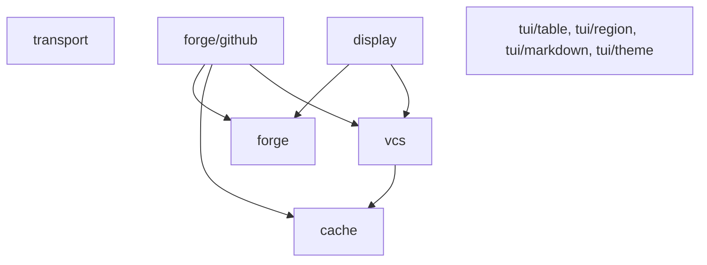

# Design

Architecture and the rules that decide what belongs here. The package inventory is
in [README.md](README.md), what an extraction costs is in
[docs/extraction.md](docs/extraction.md), and Go conventions are in
[AGENTS.md](AGENTS.md).

## What earns a package

Nothing is designed here first. A package arrives when a second tool needs code a
first tool already wrote and proved, so every package has at least one real consumer
and the API is whatever that consumer was already calling. `docs/extraction.md`
records the mechanics; the judgment call is the seam, which follows consumer
coupling rather than file boundaries.

The counterpart rule matters as much: a package leaves the consumer only once it has
no import back into that consumer's `internal/`. That is what makes each move a
mechanical rename at the call sites instead of a redesign.

## Layers

Three properties hold across that graph:

- The `forge` model and `vcs` never import each other. One is remote host state and
  the other is the local checkout, and a tool that shows both is the thing that joins
  them. `display` importing both is what lets that join live here instead of in every
  consumer. `forge/github` is the exception, and only downward: it calls `vcs.Stamp`
  to key its caches to a checkout and `vcs.GetGitHubEnv` to reach the right host
- The `tui/` packages import lipgloss and nothing else from this module. They are
  the only place a rendering library appears, so a consumer that wants the data
  packages pays nothing for the terminal ones
- `cache` sits under everything and depends on nothing. `transport` has no in-module
  consumer at all: it exists purely as a seam a tool wires into its own client, which
  is why gh-sweep can take it without taking `forge`

## Rendering without a vocabulary

A palette is generic and style names are an application's vocabulary. `PROpenStyle`
and `NotesBadgeStyle` mean something to one dashboard and nothing here, so the split
runs between them: `tui/theme` ships the Catppuccin flavors and the
terminal-background detection, and each consumer keeps its own named styles built
from a palette.

Everything else under `tui/` follows from that. `tui/markdown` takes a `Styles`
argument naming three roles rather than reaching for a palette, and `tui/table` and
`tui/region` take rendered strings and measure them. None of them can name a color.

`display` is the same rule one step further out: it emits plain strings with no
styling at all, because two tools reading one checkout style it differently even when
they agree on the words.

## Detection is deterministic

`theme.Detect` reads `CATPPUCCIN_THEME` first and falls back to the terminal
background. A background it cannot query reads as dark, so a piped run, a captured
golden fixture, and CI all resolve to Macchiato instead of flipping on whether a TTY
was attached. `theme.Select` takes the override and the probe as arguments, which is
what makes that testable.

## Testing

Table-driven unit tests next to the code, in a `_test` package. Two seams exist
specifically so consumers can test against this module without a network or a
checkout:

- `transport` registers a fake `http.RoundTripper`, and its mutation guard panics on a
  real mutating request when no fake is registered, so a test can never write to a
  live API
- `cache/testing.go` supplies an advanceable clock, a byte-budgeted disk store, and a
  store pointed at a test directory

`vcs` covers git and jj against real repositories created in `t.TempDir`, because the
behavior worth testing is what the binaries actually print.
